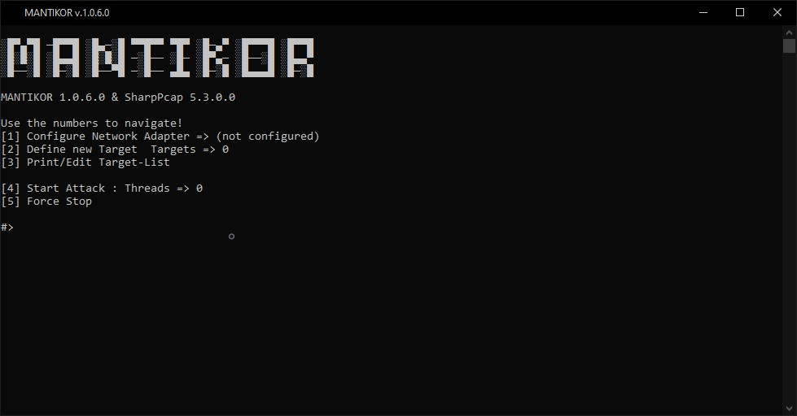

# Mantikor
``` 
Disclaimer: This project is for demonstration purposes and should not be used for illegal acts! 
Please have a look at why I published this tool. Thanks
```


## Whats Mantikor?
Mantikor is an Open-Source address-resolution spoofing-Tool. The application is written in C# with the use of SharpPcap and PacketDotNet. I created the software to learn more about ARP and NDP Spoofing which results in a better understanding how to prevent and detect it in local networks. 

## Why publishing another ARP and NDP spoofing tool?
During my studies to become an IT specialist, I started to get very interested in programming network applications. Thereby, I noticed the huge number of possibilities and vulnerabilities in network protocols. After a short time, I got familiar with the ARP and NDP protocols and started to get frightened by how easily I could program such a tool.
The intention now of my project is to give everyone an example of how easy it is to get hacked in an IP network. Unfortunately, nothing has been done about the worst and biggest security holes in IP networks for so many years now. Therefore, my project is only designed to serve as a demonstration to make people aware of exactly these problems.

## What is the easiest way to prevent spoofing?
The easiest solution for me to prevent ARP and NDP spoofing was to manually (statically) enter the MAC address of my gateway into the tables.
1.  With Windows this can be done quite easily with the Powershell: (Example)
```
Get-NetAdapter
```
Which returns:
```
Name      InterfaceDescription                    ifIndex Status       MacAddress         LinkSpeed
----      --------------------                    ------- ------       ----------         ---------
Wi-Fi     Intel(R) Dual Band Wireless                  18 Disconnected 12-34-56-AB-CD-EF     6 Mbps
Ethernet  Intel(R) Ethernet Connection …                9 Up           78-90-12-GH-IJ-KL     1 Gbps
```
2.  To create a static ARP cache entry for that interface (that survive a reboot):
```
New-NetNeighbor -InterfaceIndex 9 -IPAddress '192.168.178.1' -LinkLayerAddress '0000120000ff' -State Permanent
```
3.  You can remove the entry we just created by running this:
```
Remove-NetNeighbor -InterfaceIndex 9 -IPAddress '192.168.0.10'
```

The same works for NDP. For this, the IPv6 address must be used instead of the IPv4 address of the gateway in step 2.

## The goal of the project
Mantikor should be expanded into a professional pentesting software with a graphical user interface under Windows and a console under Linux. The application is intended to test safety systems for their function and reliability. ARP spoofing and NDP poisoning have to be impossible with new implementations and protection mechanisms. I would like to support the development of a new standard that fixes the security problems of ARP and NDP. 

## How to use Mantikor
Mantikor is designed as a console program and can therefore also be executed directly via cmd or powershell. To select an item in the menu, the listed numbers are used. Mantikor allows to spoof either over IPv4/IPv6 or both protocols i.e. ARP and NDP at the same time.

## What you need
To compile Mantikor you need .NET 4.8, Visual Studio and Npcap installed on your computer. Mantikor was not developed with .NET Core!

## Changelog
- V1.0.7 - Upgrade to SharpPcap V.6.1, also resolves MAC over IPv6.

## Copyright
The contents and works in this software created by the software operators are subject to German copyright law. The reproduction, editing, distribution and any kind of use outside the limits of copyright law require the written consent of the respective author or creator. Downloads and copies of this software are only permitted for private, non-commercial use.

Insofar as the content on this software was not created by the operator, the copyrights of third parties are observed. In particular, third-party content is identified as such. Should you nevertheless become aware of a copyright infringement, please inform us accordingly. If we become aware of any infringements, we will remove such contents immediately.

Source: [eRecht24.de](https://www.e-recht24.de/)
Cheers 👀
